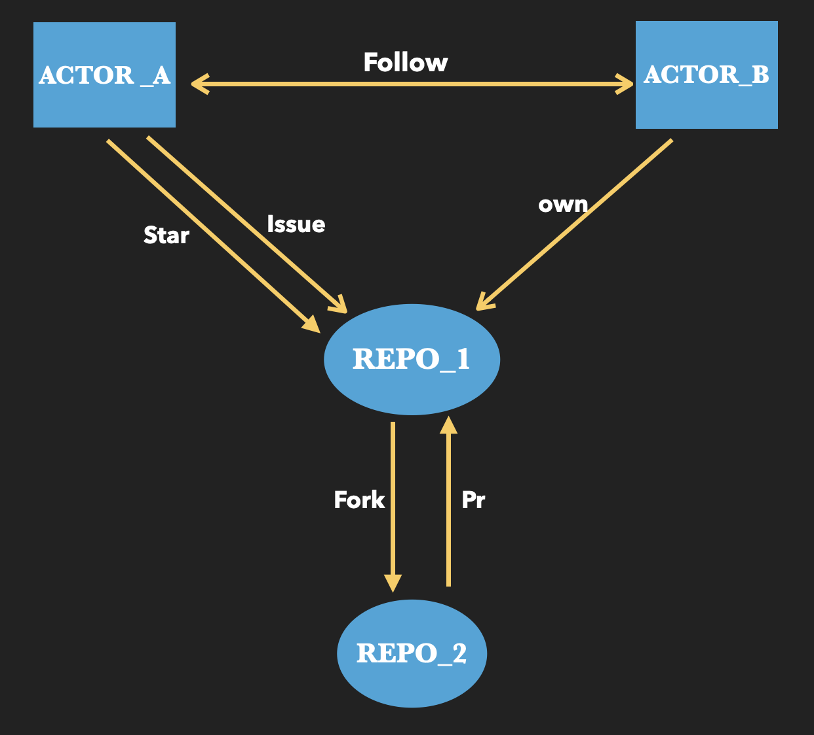

# GitHub影响力分析

## 项目背景及研究意义

- GitHub是最大的git仓库托管商，许多开发者都使用该平台进行开源项目的git托管、议题追踪、代码评审等。
- 由于用户人数众多，项目数量巨大，因此难以直接找到高水平，高热度，高价值的开发者和项目。
- 通过分析GitHub数据集，衡量开发者和开源项目的影响力，帮助我们找到具有较高价值的用户和项目，以及一段时间的热点项目。
- 有价值的用户和项目也因此可以得到更多关注和建议，有助于项目更加良好的发展。

## github的用户交互形式

## 影响力相关算法

### pagerank

**思想**

PageRank算法是一个链接分析算法，是用来衡量搜索引擎搜索到的结果网页重要程度并进行排序的一种算法。PageRank算法通过计算网络页面的链接数量和质量来确定网站的重要性。

该算法基于以下假设

- 如果一个网页被很多其他网页所指向，那么说明这个网页比较重要； 
- 如果一个网页被重要网页所指向，那么说明这个网页比较重要。

因为用户的影响力也符合类似假设，所以可以尝试用pagerank算法计算用户影响力并排序

- 如果一个用户被很多其他用户follow了，那么说明这个用户比较有影响力；
- 如果一个用户被影响力大的用户follow了，那么说明这个用户比较有影响力。

**计算**
$$
rank(u) = \frac{1-q}{N}+q*\sum\limits_{(v_i,u)\in E}\frac{rank(v_i)}{N(v)}
$$
**输入**  用户Follow图 G = <V,E>

**步骤**

1. 初始化所有节点的rank值为1
2. 遍历每一个结点，更新rank值
3. 重复步骤2，直到收敛
4. 排序输出

### HIST

**思想**

与PageRank算法比较相像，不过每个页面被赋予两个属性：Hub 值和 Authority 值。根据页面两个属性值的大小，网页可以被分为 Hub 页面和 Authority 页面。Hub 页面是指包含了很多指向Authority 页面的链接的页面；Authority 页面是指包含了较多实质性内容的页面。

HITS算法基于以下两个假设

- 一个高质量的 Authority 页面会被很多高质量的 Hub 页面所指向；
- 一个高质量的 Hub 页面会指向很多高质量的 Authority 页面。

用户的影响力也可以符合类似假设，Authority用户是开发能力较强的用户，Hub用户是喜欢关注Authority用户的用户。

- 一个影响力强的 Authority 用户会被很多影响力强的 Hub 用户所follow；
- 一个影响力强的 Hub 用户会follow很多影响力强的 Authority 用户。

**计算**
$$
a(u)=\sum\limits_{(v_i,u)\in E}h(v_i)\\
h(u)=\sum\limits_{(w_i,u)\in E}a(w_i)
$$
**输入** 用户Follow图 G = <V,E>

**步骤**

1. 初始化：将各节点的a值和h值均设为1

2. 遍历每一个结点，更新节点的a值

3. 遍历每一个结点，更新节点的h值

4. 将a值和h值归一化

5. 重复2-4步骤，直至最终收敛
6. 排序输出

### BurstBiRank

**pagerank和hist存在的问题**：只考虑了用户的follow网络，没有考虑用户和项目的行为

BurstBiRank思想：

1. Burstiness，突发性。在许多现实世界或在线系统中，人们的活动通常是间歇性的，在短时间内表现出强烈的活动，然后是长时间的活动减少，甚至没有活动。突发性度量被提出来衡量行为偏离周期性行为的程度，$B=\frac{\sigma_t-m_t}{\sigma_t+m_t}$，其中$\sigma_t$和$m_t$分别代表用户活动时间间隔的标准差和平均值.
2. Bipartite，两部分组成的。$G=(U\cup P,E)$,考虑到了开发者和项目的交互行为。用矩阵$W(\in R^{|U|\times|P|})$描述这个图，$w_{ij}$表示开发者$i$和项目$j$之间关联强度。$W_{ij}=f(B_{ij})$

